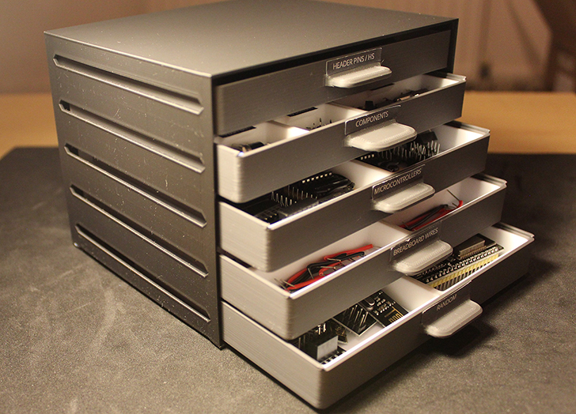
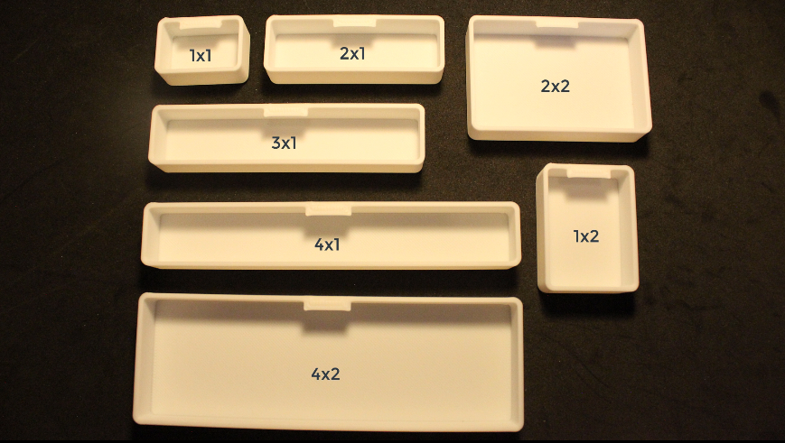

# Small item organiser

This repo is only used to host the 3D files for the small item organiser. There is a [video](https://youtu.be/E5vvo4CLFvw) showcasing and explaining the organiser.

## 3D models

- `/containers`, all the boxes/containers. It is up to you to choose which containers to print to meet your exact needs.
- `/drawer_housings`, the main and biggest part, this is where the drawers are inserted into.
    - You are able to choose from 8 sizes, from `2` to `9`, which represents how many drawers each housing can fit.
- `drawer.stl`, print to match the housing size you have chosen. For example, if you have chosen the housing of size 5, then you will need to print 5 drawers.
    - Note: Print the drawers with supports, this is needed only for the handle.
- `sliding_lid.stl`, this is optional, only needed if you want a lid for a drawer.

## Containers

